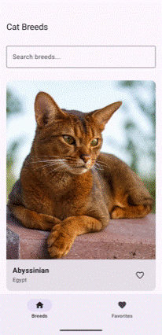

This project was developed as part of a coding challenge for [Sword Health](https://swordhealth.com/)

# Cat Breeds - Android App
A modern Android application built with Kotlin that integrates with [The Cat API](https://thecatapi.com/) to showcase cat breeds. This project demonstrates a clean separation of concerns with an MVVM architecture, Jetpack Compose UI, offline functionality, unit testing, error handling, and follows Android development best practices.



## Features
- **Browse Cat Breeds**: View a list with images and basic information
- **Search Functionality**: Filter breeds by name
- **Favorites Management**: Mark/unmark breeds as favorites
- **Detailed View**: Visit a breed page to check further details
- **Offline support**: Access previously loaded data without an internet connection

## Technical Stack
- **Kotlin**: Primary programming language
- **Jetpack Compose**: UI toolkit
- **Jetpack Navigation**: Navigation between screens
- **Room Database**: Local data persistence
- **Retrofit**: Network requests
- **Coroutines & Flow**: Asynchronous programming
- **Coil**: Image handling
- **Dagger Hilt**: Dependency Injection

### Other Libraries
- **MockK**: 'Mocking' for Unit Tests
- **Google Gson**: JSON -> objects converter

## Project Structure

```
app/src/main/java/com/example/catbreeds/
├── data/
│   ├── connectivity/     # Network connectivity checking
│   ├── di/              # Dependency injection modules
│   ├── local/           # Room database, DAOs, entities
│   ├── remote/          # Retrofit service, API configuration
│   └── repository/      # Repository implementation
├── domain/
│   ├── models/          # Data models
│   ├── repository/      # Repository interface
│   └── utils/           # Utility classes and interfaces
└── ui/
    ├── breedDetail/     # Breed detail screen
    ├── breedList/       # Main breeds list screen
    ├── favoriteList/    # Favorites screen
    ├── navigation/      # Navigation setup
    ├── theme/          # App theming
    └── util/           # UI utilities
```

## Setup

- Minimum SDK: API 24 (Android 7.0)
- Target SDK: API 34

1. Clone the repository
2. Open the project in Android Studio
3. Add your Cat API key to `local.properties`:
   ```
   API_KEY="your_cat_api_key_here"
   ```
4. Build and run the application